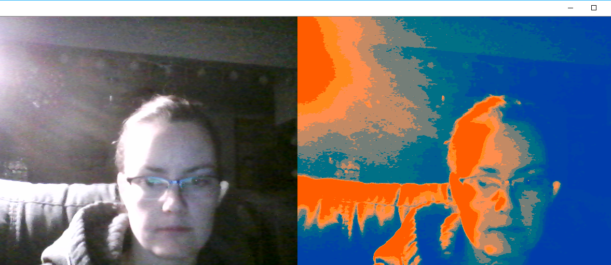

# colorQuantizationKMeans

Script uses K Means clustering to segment a webcam feed into a predefined number of colors. This is known as color quantization. The script uses MiniBatchKMeans since this is faster than normal K Means Clustering. MiniBatchKMeans operates on small “batches” of the dataset, whereas K-Means operates on the population of the dataset, thus making the mean calculation of each centroid, as well as the centroid update loop, much slower

K Means Clustering partitions n data points into k clusters. Each of the n data points will be assigned to a cluster with the nearest mean. The mean of each cluster is called its “centroid” or “center”. Overall, applying k-means yields k separate clusters of the original n data points. Data points inside a particular cluster are considered to be “more similar” to each other than data points that belong to other clusters. In this script, each separate cluster will represent a different color in the image.

